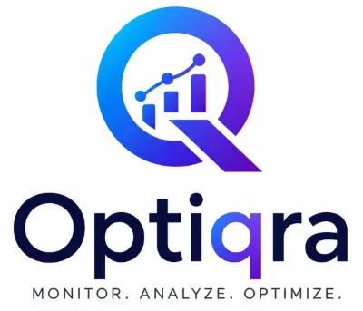

# OptiQra

OptiQra is a Next.js website auditing experience for spotting SEO, performance, accessibility, security, and conversion issues. Paste a URL, run a diagnostic, and review a structured report with actionable findings.




## What it does

- Scans a target URL and produces a multi-category audit report
- Checks SEO metadata, structured data, robots files, and sitemaps
- Evaluates performance-related HTML and response characteristics
- Reviews accessibility issues such as missing labels and contrast problems
- Audits key security headers and conversion-oriented signals
- Optionally uses PageSpeed Insights when a PSI API key is configured

## 📚 Tech stack

- Next.js 16
- React 19
- TypeScript 5
- Cheerio for HTML parsing
- ESLint and Next.js linting configuration

## 🚀 Quick start

### Prerequisites

- Node.js 18 or newer
- npm

### Local development

```bash
npm install
npm run dev
```

Open http://localhost:3000 in your browser.

### Environment variables

The app can run its built-in audits without extra configuration. If you want PageSpeed Insights support, set:

```bash
export PSI_API_KEY=your_google_pagespeed_insights_api_key
```

## Available scripts

```bash
npm run dev      # Start the development server
npm run build    # Create a production build
npm run start    # Start the production server
npm run lint     # Run ESLint
```

## Docker

```bash
docker compose up --build
```

The app will be available at http://localhost:3000.

## API

### POST /api/analyze

Send a JSON body containing a URL:

```json
{
	"url": "https://example.com"
}
```

The endpoint returns a report with categories such as security, SEO, performance, accessibility, and conversions, along with issue details and scores.

## Project structure

- src/app/page.tsx: the main diagnostic UI
- src/app/api/analyze/route.ts: the analysis orchestration endpoint
- src/lib: audit modules for SEO, speed, accessibility, links, images, security headers, and PageSpeed

## 🌱 Roadmap

### v0.2

- [x] SEO audit
- [x] Accessibility audit
- [x] Performance audit
- [x] Conversion analysis
- [x] Security header analysis
- [x] robots.txt analysis
- [x] Sitemap analysis
- [x] Structured data detection
- [x] Google Lighthouse integration

### v0.3

- [x] Advanced link analyzer
- [x] Advanced image analyzer
- [x] Open Graph preview
- [x] Twitter card preview
- [x] Security score improvements
- [ ] HTTP/2 and HTTP/3 detection
- [ ] Core Web Vitals visualization

### v0.5

- [x] Whole website crawler
- [x] Multi-page SEO reports
- [ ] Duplicate content detection
- [ ] Internal linking analysis
- [ ] Broken link detection
- [x] Crawl visualization

### v1.0

- [ ] AI website review
- [ ] AI generated fixes
- [ ] Competitor comparison
- [ ] Historical scan tracking
- [ ] CI/CD integration
- [ ] GitHub pull request fixes

## 💡 Vision

OptiQra aims to grow from a single-page auditing tool into a complete AI-powered website optimization platform capable of crawling entire websites, identifying issues, prioritizing improvements, generating fixes, and helping developers build faster, more secure, and more accessible web experiences.

## 🤝 Contributing

Contributions are welcome. You could go start working on the next feature on the roadmap or add something something you think would make the app better. If you make changes, please keep the audit output shape consistent and verify the app still builds locally.

## Made by ArminNX and the community
