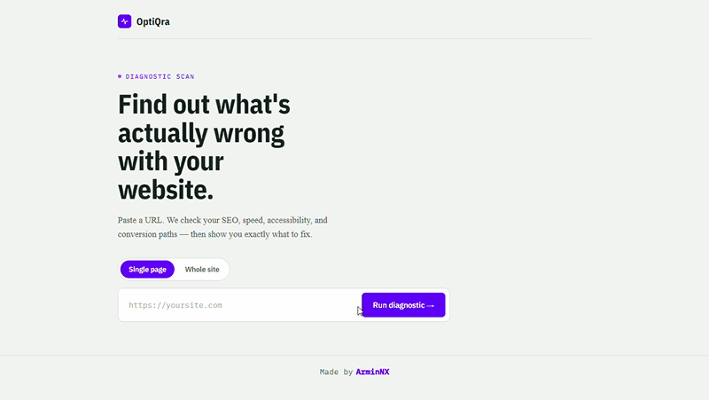

# OptiQra

OptiQra is an AI optimized SEO crawling analyzer that crawls analyzes every page associated with the url the user inputs and creates visual tree and scores based on its SEO of the whole site and each page it has crawled through.


See a live demo via the vercel deployment: https://optiqra.vercel.app


## What it does

- Crawlers through the site via internal links in the sitemap and analyzes every page
- Scans a target URL and crawls its associated links and produces a multi-category audit report
- If the user has entered an api key it will allow the user to generate a fix with AI for each Issue
- Creates a visual tree of the pages it has crawled with the abilty to hover or cilck each page to see its individual stats
- Checks SEO metadata, structured data, robots files, and sitemaps
- Evaluates performance-related HTML and response characteristics
- Reviews accessibility issues such as missing labels and contrast problems
- Audits key security headers and conversion-oriented signals
- Optionally uses PageSpeed Insights when a PSI API key is configured
- Schedule periodic re-scans (hourly, daily, weekly, monthly, yearly) that run unattended, compare each result against the previous scan, and can notify you via browser notification when they finish

## Showcase


## 📚 Tech stack

- Next.js 16
- React 19
- TypeScript 5
- Cheerio for HTML parsing
- ESLint and Next.js linting configuration

## 🚀 Quick start

### Prerequisites

- Node.js 18 or newer
- npm

### Local development

```bash
npm install
npm run dev
```

Open http://localhost:3000 in your browser.

### Environment variables

The app can run its built-in audits without extra configuration. If you want PageSpeed Insights support, set:

```bash
export PSI_API_KEY=your_google_pagespeed_insights_api_key
```

## Available scripts

```bash
npm run dev      # Start the development server
npm run build    # Create a production build
npm run start    # Start the production server
npm run lint     # Run ESLint
```

## Docker

```bash
docker compose up --build
```

The app will be available at http://localhost:3000.

## Periodic scans

Click **⏱ Schedule this scan** on a report (or **⏱ Scheduled scans** in the header to manage all of them) to have OptiQra re-scan a URL on a recurring cadence — hourly, daily, weekly, monthly, or yearly. Each run:

- Saves a new report to this browser's scan history, same as a manual scan.
- Optionally compares the new report against the most recent previous scan of that URL — score change, new issues, resolved issues.
- Optionally fires a browser notification with a one-line summary once it finishes.

**Scope/limitations, to be upfront about them:** OptiQra has no server, database, or user accounts — schedules and their history live entirely in this browser's IndexedDB (`src/lib/scheduleStore.ts`). A background checker (`src/lib/scheduler.ts`) runs while any tab of the app is open (or installed as a PWA) and checks every minute for schedules that are due, so you don't need to keep the report on screen or babysit a scan — but scans only fire while the browser process itself is running somewhere. There's a best-effort attempt to register the [Periodic Background Sync API](https://developer.chrome.com/docs/capabilities/periodic-background-sync) on browsers/installs that support it, which can extend this a little further, but that API has no guaranteed interval and isn't available in most browsers — treat it as a bonus, not a guarantee. For true "runs even when nothing is open" scheduling you'd want a server-side cron job hitting `/api/analyze` instead.


## API
### POST /api/analyze

Send a JSON body containing a URL:

```json
{
	"url": "https://example.com"
}
```

The endpoint returns a report with categories such as security, SEO, performance, accessibility, and conversions, along with issue details and scores.

## Project structure

- src/app/page.tsx: the main diagnostic UI
- src/app/api/analyze/route.ts: the analysis orchestration endpoint
- src/lib: audit modules for Crawler, AI, SEO, speed, accessibility, links, images, duplicate content, broken links, security headers, and PageSpeed
- src/lib/scheduler.ts, scheduleStore.ts, scanCompare.ts, notifications.ts: periodic re-scan engine (see "Periodic scans" below)

## 🌱 Roadmap

### v0.2

- [x] SEO audit
- [x] Accessibility audit
- [x] Performance audit
- [x] Conversion analysis
- [x] Security header analysis
- [x] robots.txt analysis
- [x] Sitemap analysis
- [x] Structured data detection
- [x] Google Lighthouse integration

### v0.3

- [x] Advanced link analyzer
- [x] Advanced image analyzer
- [x] Open Graph preview
- [x] Twitter card preview
- [x] Security score improvements
- [ ] HTTP/2 and HTTP/3 detection
- [ ] Core Web Vitals visualization

### v0.5

- [x] Whole website crawler
- [x] Multi-page SEO reports
- [x] Duplicate content detection
- [x] Internal linking analysis
- [x] Broken link detection
- [x] Crawl visualization

### v1.0

- [x] AI website review
- [x] AI generated fixes
- [ ] Competitor comparison
- [x] Historical scan tracking
- [x] Periodic (scheduled) scans with change detection and notifications
- [ ] CI/CD integration
- [ ] GitHub pull request fixes

## 💡 Vision

OptiQra aims to grow from a single-page auditing tool into a complete AI-powered website optimization platform capable of crawling entire websites, identifying issues, prioritizing improvements, generating fixes, and helping developers build faster, more secure, and more accessible web experiences.

## 🤝 Contributing

Contributions are welcome. You could go and work on an issue or maybe start working on the next feature on the roadmap or add something something you think would make the app better. If you make changes, please keep the audit output shape consistent and verify the app still builds locally.

## Made by ArminNX and the community
