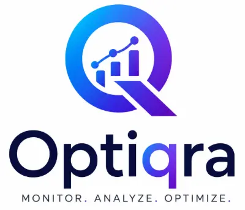
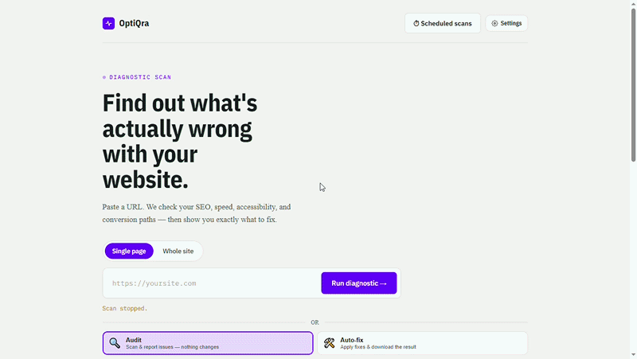

# OptiQra

**Audit your site for both search engines and AI.** OptiQra crawls your entire website and scores it across SEO, performance, accessibility, security, and conversion signals — plus **GEO** (generative engine optimization) and **AEO** (answer engine optimization). ChatGPT, Claude, Perplexity, and Google's AI Overviews now send meaningful traffic of their own. OptiQra tells you if your site is set up to be crawled, cited, and answered by them — and then fixes it for you.


[](https://optiqra.vercel.app/)

**[Live demo](https://optiqra.vercel.app)** · Free, no signup, no account · Also available as a [native desktop app](https://github.com/armin5872/OptiQra/releases/tag/v2.4.15) for background scans and fully offline project audits

<!-- SLOT: hero screenshot / product shot — main scan report view -->


<!-- SLOT: showcase.gif — full walkthrough gif (crawl → report → AI fix) -->


## Contents

- [Core audits](#core-audits)
- [Beyond audits: fixes, not just findings](#beyond-audits-fixes-not-just-findings)
- [OptiQra Desktop](https://github.com/armin5872/OptiQra/releases/tag/v2.4.15)
- [How it works](#how-it-works)
- [How OptiQra compares](#how-optiqra-compares)
- [Tech stack](#-tech-stack)
- [Quick start](#-quick-start)
- [Building the desktop app](#building-the-desktop-app)
- [Docker](#docker)
- [Periodic scans](#periodic-scans)
- [Localization](#localization)
- [API](#api)
- [Project structure](#project-structure)
- [Security](#security)
- [Roadmap](#-roadmap)
- [Contributing](#-contributing)

## Core audits

### 🔍 Site crawling & indexing
- Crawls entire sites through sitemaps and internal links (configurable page cap)
- Detects duplicate and near-duplicate content (repeated titles, byte-identical pages, thin/templated content)
- Analyzes links (broken links, internal/external, redirect chains)
- Scans images (missing alt text, lazy loading, responsive `srcset`/`<picture>` usage)
- **JS-rendered content detection** — runs a page's own JavaScript in a sandboxed environment to see the post-hydration DOM, the same way a JS-executing crawler like Googlebot would, instead of guessing from raw HTML alone

### 🎯 SEO essentials
- Meta tags (title, description, canonical, Open Graph, Twitter cards)
- Structured data (JSON-LD, schema.org validation)
- robots.txt and sitemap analysis, with one-click generation of a starter sitemap/robots.txt when either is missing
- Internal linking patterns and anchor text quality
- **PageSpeed Insights integration** for real Core Web Vitals data

### 🤖 Generative Engine Optimization (GEO)
- **Entity grounding** — checks for authoritative `sameAs` links (Wikipedia, Wikidata, Crunchbase, LinkedIn, GitHub) that help AI models cite and disambiguate your content
- **Client-side rendering detection** — flags content hidden behind client-side JavaScript that generative crawlers (GPTBot, ClaudeBot) can't see
- **Citation-friendliness** — analyzes whether pages are structured to be easily quoted and attributed in AI answers
- **llms.txt generator** — drafts a starter `llms.txt` for your site from an AI provider of your choice

### 🤖 Answer Engine Optimization (AEO)
- **Crawler access** — checks whether AI answer-engine crawlers (GPTBot, ClaudeBot, PerplexityBot, Google-Extended, etc.) are allowed or blocked by robots.txt
- **Answer-liftable content** — detects whether key content is structured to be extracted directly into answers, Q&A format, and featured snippets
- **Q&A structuring** — validates whether content is formatted to answer common questions about your domain

### ⚡ Performance
- HTML/response performance characteristics
- Optional PageSpeed Insights scoring for lab + field data

### ♿ Accessibility
- Missing alt text, labels, and ARIA attributes
- Color contrast problems
- Keyboard navigation and semantic HTML issues

### 🔐 Security
- Security headers (HSTS, CSP, X-Frame-Options, etc.)
- Conversion signals and trust badges
- Tech-stack fingerprinting (CMS, framework, e-commerce platform, page builder, server/language) so fixes can be written for *your* actual stack

## Beyond audits: fixes, not just findings

<!-- SLOT: screenshot/gif — auto-fix diff / "before → after" view -->

OptiQra doesn't stop at a scored report. It can fix what it finds:

- **Deterministic auto-fix** — mechanical issues (a missing tag, a bad attribute, content that already exists elsewhere on the page) are fixed directly, no AI involved, 100% reproducible
- **AI-authored fixes** — content that needs actual writing (titles, meta descriptions, alt text, form labels, CTA copy) is batched into a single AI call using your own API key
- **Full AI Fix** — an opt-in, deeper pass that hands the model an entire file plus its detected issues and asks for the whole file back, fixed, for anything the deterministic and batched passes couldn't resolve
- **Framework-aware fixes** for HTML, JSX/TSX, Vue, Nuxt, Angular, Svelte, and Astro — not just generic markup edits
- **Project (codebase) audits** — upload a `.zip` of your actual project instead of only scanning a live URL, and get the same scored SEO/performance/accessibility categories, plus config-file-level fixes (headers, compression, sitemap/robots.txt) that a live-URL scan can never make since it can't see your source
- **Integrity-checked** — every text-splicing fix pass is verified against structural invariants afterward; if anything looks off, the change is discarded rather than shipped
- **A visual "highlighted clone"** of any scanned page, annotated element-by-element with the exact issues found, rendered in an iframe instead of only listed in a table
- **Propose upstream** — turn a custom rule or settings preset you built into a real GitHub pull request against this repo, via GitHub's own "create file" flow — no token, no server in the middle

### 🌌 3D / Galaxy crawl visualization

<!-- SLOT: screenshot or gif — 3D and Galaxy crawl tree views -->

Beyond the standard tree view, OptiQra can render a crawled site as an interactive 3D structure or an animated "galaxy" of pages (Three.js), letting you spot structural and performance patterns across hundreds of pages at a glance.

### 🎭 AI insights, moods, and custom rules
- **Site-wide AI insights** — a strategic summary reasoning across every category and page
- **AI moods & potency** — pick the persona the AI writes fixes/insights in, and how strongly it leans into that persona
- **Custom rules** — small, client-side JS snippets you author to post-process a finished scan and surface additional findings specific to your site
- **Custom code** — inject raw CSS or a one-off JS snippet into the report view itself

### 📊 Reports & data
- **Multi-provider AI** — paste an API key (yours to keep) for OpenAI, Anthropic, Google, Groq, OpenRouter, Mistral, DeepSeek, or xAI (Grok)
- **Export to PDF, DOCX, XLSX, Markdown, CSV, TSV, TXT, JSON**
- **13 languages** — the entire UI is translatable (see [Localization](#localization))
- **Periodic scanning** — schedule re-scans (hourly to yearly), get notifications, auto-compare against previous results
- **PWA + offline** — installable in-browser, past reports visible without internet

## 🖥️ OptiQra Desktop

<!-- SLOT: screenshot — desktop app main window -->
<!-- SLOT: screenshot — system tray / "sits in the tray" state -->
<!-- SLOT: gif — closing the window, tray icon staying alive, notification firing -->

OptiQra also ships as a native desktop app, built with **Tauri 2** (Rust shell + the same Next.js engine as the web app, running locally). It exists to solve one specific limitation of the browser version:

> A browser-based scheduler only fires while a tab is open. The desktop app fires schedules from a background process that keeps running after you close the window.

**What's actually different, not just wrapped:**

| | Web app | Desktop app |
|---|---|---|
| Scheduled scans | Only while a tab/PWA is open | Run from a background daemon — the window can be fully closed |
| Project (codebase) audits | Needs a network round-trip | Fully offline — the audit engine runs on your machine |
| Live-site crawling & AI fixes | Needs a network round-trip | Still needs a network round-trip (crawling a live site or calling an AI provider inherently does) |
| Notifications | Browser Notification API | Real OS notifications, even with no window visible |
| Scores/ruleset | Same engine | Identical engine — no separate desktop ruleset to drift out of sync |

**How it works under the hood:**
- The Rust shell spawns the same Next.js app (built `output: "standalone"` and packaged as a single executable) as a background **sidecar** process, and points the window's webview at it — it does not reimplement the crawler/audit/fix engine in Rust.
- Closing the window **hides** it instead of quitting; only the tray menu's "Quit" actually stops the sidecar (and therefore the scheduler).
- A scheduler daemon inside the sidecar mirrors the same due/compare/notify logic the browser's `scheduler.ts` uses, so a schedule behaves identically whether a tab or the daemon catches it — it just reads/writes a local file store instead of IndexedDB, and notifies through the OS instead of the browser.
- The browser UI's schedule/scan stores and the daemon's file store are kept in sync automatically: creating or editing a schedule mirrors into the daemon's store, and any scan the daemon ran while the window was closed appears in *Recent Scans* the next time you open the app.
- Single-instance locking, autostart, and an in-app updater (checked against GitHub Releases) are included.

**Platforms:** macOS 12+ (Apple Silicon & Intel), Windows 10/11 (x64), Linux (AppImage / `.deb`).

Download the latest build from the [releases page](https://github.com/armin5872/OptiQra/releases/latest), or see [Building the desktop app](#building-the-desktop-app) to build it yourself.

## How it works

1. **Paste a URL** (or upload a project `.zip`) — any website, any size
2. **OptiQra crawls it** — follows internal links, scans every page (or every file, in project mode)
3. **See results in seconds** — visual/3D/galaxy tree of all crawled pages, scores by category, detailed issue list
4. **Apply fixes** — deterministic fixes apply automatically; content-authoring fixes use your chosen AI provider
5. **Get AI insights** — (optional) a site-wide strategic summary reasoning across all categories and pages

Everything runs in your browser (or, with the desktop app, entirely on your machine). No server sees your data unless you're scanning a live URL. No account needed.

## How OptiQra compares

| Feature | OptiQra | Lighthouse | SEMrush | Ahrefs |
|---|---|---|---|---|
| **Full-site crawl** | ✅ Free | ❌ Single page | ✅ Paid | ✅ Paid |
| **GEO/AEO audits** | ✅ Yes | ❌ No | ❌ No | ❌ No |
| **AI-generated & applied fixes** | ✅ Yes (your API key) | ❌ No | ❌ No | ❌ No |
| **Codebase / project audits** | ✅ Yes, offline in desktop app | ❌ No | ❌ No | ❌ No |
| **Background scheduled scans** | ✅ Yes (desktop app) | ❌ No | ✅ Paid | ✅ Paid |
| **No signup required** | ✅ Yes | ✅ Yes | ❌ No | ❌ No |
| **Runs in browser / offline** | ✅ Yes | ✅ Yes | ❌ No | ❌ No |
| **Free forever** | ✅ Yes | ✅ Yes | ❌ No | ❌ No |
| **Open source** | ✅ Yes | ✅ Yes | ❌ No | ❌ No |

**OptiQra's edge:** free full-site crawls, AI-native audits (GEO/AEO), fixes that actually apply (not just suggestions), and a desktop app for offline project audits and background scheduling — all with no account and no subscription.

## Why this matters

SEO isn't just about Google anymore. **ChatGPT, Claude, Perplexity, and Gemini now generate answers that cite (or don't cite) your site.** But most auditing tools haven't caught up — they still measure you against Googlebot alone.

OptiQra fills that gap. It tells you:
- Whether your content is *visible* to AI crawlers (or hidden behind client-side JS)
- Whether AI models can *cite* you credibly (via entity grounding)
- Whether your content is *liftable* into direct answers
- Whether you've *allowed or blocked* AI crawlers in robots.txt

…and then, unlike a pure auditing tool, it can go fix what it finds.

## 📚 Tech stack

**Web app**
- Next.js 16, React 19, TypeScript 5
- Cheerio + jsdom for HTML parsing and sandboxed JS-rendered-page audits
- `idb` (IndexedDB) for local scan history, schedules, custom rules, and AI provider keys — backed by a custom PWA service worker for offline support and periodic-sync scans
- Three.js for the 3D / Galaxy crawl tree
- `jspdf`, `docx`, and `xlsx` for report exports; `jszip` for project-upload/unzip handling
- Sentry for error monitoring, Playwright for end-to-end testing
- ESLint and Next.js linting configuration

**Desktop app**
- Tauri 2 (Rust) shell — tray icon, single-instance lock, autostart, updater
- The same Next.js app, built standalone and packaged as a sidecar binary via `@yao-pkg/pkg`
- A Node-based scheduler daemon (`server/`) mirroring the browser scheduler's logic, using `node-notifier` for real OS notifications

## 🚀 Quick start

### Prerequisites

- Node.js 22 or newer
- npm

### Local development (web app)

```bash
npm install
npm run dev
```

Open http://localhost:3000 in your browser.

### Environment variables

The app runs its built-in audits without any configuration. AI-powered fixes and insights use a provider API key you enter in the UI rather than an environment variable, so nothing needs to be set for those either.

Everything below is optional and only matters if you want error monitoring locally. Create a `.env.local` in the project root (it's gitignored) and set any of:

| Variable | Purpose |
|---|---|
| `NODE_ENV` | `development` / `production` — set automatically by `next dev` / `next start` |
| `NEXT_TELEMETRY_DISABLED` | Set to `1` to opt out of Next.js telemetry |
| `PORT` | Dev server port (defaults to `3000`) |
| `NEXT_PUBLIC_SENTRY_DSN` / `SENTRY_DSN` | Sentry DSN — leave unset and Sentry no-ops entirely |
| `SENTRY_ORG` / `SENTRY_PROJECT` | Your Sentry project, for source map uploads |
| `SENTRY_AUTH_TOKEN` | Only needed in CI/production builds, to upload source maps |

Never commit real values for these — `.env.local` is in `.gitignore` for exactly that reason.

### Available scripts

```bash
npm run dev            # Start the development server
npm run build          # Create a production build
npm run start           # Start the production server
npm run lint            # Run ESLint
npm run type-check      # Run the TypeScript compiler in check-only mode
npm test                # Run the Playwright e2e suite (alias: npm run test:e2e)
npm run test:e2e:ui     # Run the e2e suite in Playwright's UI mode
npm run test:e2e:report # Show the last Playwright HTML report

# Desktop app (see below)
npm run desktop:dev     # Run the Next.js dev server + Tauri dev shell together
npm run desktop:build   # Full production build: Next standalone -> sidecar -> Tauri installers
```

## Building the desktop app

The desktop app is not a separate copy of the frontend — it's this same repo, run by a Tauri shell instead of a Node server.

**Local development** (no packaging, fastest loop):

```bash
next dev -p 4173   # in one terminal — the Tauri window's devUrl points at :4173
tauri dev           # in another
```

The background scheduler daemon only runs in the *packaged* sidecar, not in `next dev` — for local testing of scheduling logic, point `OPTIQRA_DATA_DIR` at a scratch directory and write a schedule by hand into `schedules.json` with a past `nextRunAt`.

**Full production build** (produces installers for the current OS):

```bash
npm run desktop:build
```

This runs, in order:
1. `DOCKER_BUILD=1 next build` — produces `.next/standalone`
2. `desktop:compile` — compiles the scheduler daemon (`server/`) with `tsc`
3. `desktop:package` — bundles the compiled daemon + standalone Next build into a single sidecar binary via `@yao-pkg/pkg`
4. `tauri build` — builds the Rust shell, embeds the sidecar, produces platform installers

Cross-platform builds need to run natively per OS (macOS/Windows/Linux) in CI — see `.github/workflows/release.yml` and `server/README.md` for the full breakdown of the sidecar packaging and the IndexedDB ↔ file-store sync between the browser UI and the daemon.

## Docker

```bash
docker compose up --build
```

The app will be available at http://localhost:3000. A `docker-compose.dev.yml` and `Dockerfile.dev` are also included for a hot-reloading development container.

## Periodic scans

Click **⏱ Schedule this scan** on a report (or **⏱ Scheduled scans** in the header to manage all of them) to have OptiQra re-scan a URL on a recurring cadence — hourly, daily, weekly, monthly, or yearly. Each run:

- Saves a new report to scan history, same as a manual scan.
- Optionally compares the new report against the most recent previous scan of that URL — score change, new issues, resolved issues.
- Optionally fires a notification with a one-line summary once it finishes.

**In the web app:** schedules and history live entirely in the browser's IndexedDB (`src/lib/scheduleStore.ts`). A background checker (`src/lib/scheduler.ts`) runs while any tab of the app is open (or installed as a PWA) and checks every minute for schedules that are due. There's a best-effort attempt to register the [Periodic Background Sync API](https://developer.chrome.com/docs/capabilities/periodic-background-sync) on browsers/installs that support it, but that API has no guaranteed interval and isn't available in most browsers — treat it as a bonus, not a guarantee.

**In the desktop app:** a background daemon inside the packaged sidecar checks schedules independently of whether the window is open — see [OptiQra Desktop](https://github.com/armin5872/OptiQra/releases/tag/v2.4.15) above. This is the actual "runs even when nothing is open" answer; the web app's Periodic Background Sync attempt can't guarantee that on its own.

## Localization

The UI is fully translatable and currently ships with 13 languages: English, Spanish, French, German, Chinese, Russian, Dutch, Persian, Korean, Japanese, Italian, Arabic, and Hindi (including right-to-left layout for Persian and Arabic). See `src/lib/i18n/`.

## AI-powered fixes and insights

If you paste in an API key for one of the supported providers (OpenAI, Anthropic, Google, Groq, OpenRouter, Mistral, DeepSeek, or xAI), OptiQra can:

- Generate and apply a suggested fix for any individual issue in a report
- Run a deeper "Full AI Fix" pass on files the deterministic/batched passes couldn't resolve
- Generate a site-wide AI insights summary that reasons across every category and page, in a mood/persona and potency you choose

Keys are entered per-session in the browser (or stored locally in the desktop app) and sent straight to the provider you chose to make the request — OptiQra's own server never sees or stores them.

## PWA and offline support

OptiQra is installable as a Progressive Web App. Completed scans and schedules are saved locally in IndexedDB, so past reports remain viewable offline and survive reloads; a lightweight pointer to your recent scan history is also kept in a capped cookie for fast, synchronous access. For audits that need to work *fully* offline, including project/codebase uploads, see [OptiQra Desktop](https://github.com/armin5872/OptiQra/releases/tag/v2.4.15).

## API

### `POST /api/analyze`

Send a JSON body containing a URL:

```json
{
  "url": "https://example.com"
}
```

Returns a report with categories such as SEO, GEO/AEO, performance, accessibility, security, and conversions, along with issue details and scores. Outbound requests are validated against SSRF (blocked private/loopback/link-local IP ranges, including DNS rebinding checks) before being fetched — see `src/lib/urlSafety.ts`.

### `POST /api/analyze/stop`
Cancels an in-progress crawl.

### `POST /api/clone`
Builds an annotated "highlighted clone" of a scanned page for the issue-overlay view.

### `POST /api/auto-fix`
Runs the deterministic + AI-assisted auto-fix engine against a single scanned page.

### `POST /api/auto-fix-project`
Runs project-wide audit/fix over an uploaded codebase archive (streams NDJSON progress). Also powers the offline project-audit path in the desktop app.

### `POST /api/ai-fix`
Generates an AI-written fix for a single issue, given a provider, API key, and issue details.

### `POST /api/ai-insights`
Generates a site-wide AI insights summary across a full report.

### `POST /api/ai-test` / `POST /api/ai-engine-test`
Verifies that a given provider/API key/model combination is reachable and working.

### `POST /api/generate-llms-txt`
Drafts a starter `llms.txt` for a site using an AI provider of your choice.

### `POST /api/pagespeed`
Fetches Google PageSpeed Insights data for a URL.

### `GET /api/health`
Health check used by the desktop sidecar to know when the local server is ready.

## Project structure

- `src/app/page.tsx`: the main diagnostic UI
- `src/app/app/page.tsx`: the desktop app landing/download page
- `src/app/api/analyze/route.ts`: the analysis orchestration endpoint
- `src/app/api/auto-fix`, `auto-fix-project`, `ai-fix`, `ai-insights`, `ai-test`, `ai-engine-test`, `generate-llms-txt`, `pagespeed`, `clone`: fix/AI/utility endpoints
- `src/lib`: audit modules — crawler, SEO, GEO, AEO, structured data, performance, accessibility (via HTML audit), security headers, links, images, duplicate content, and tech-stack detection
- `src/lib/autoFixEngine.ts`, `jsxAutoFix.ts`, `projectFixEngine.ts`, `fullAiFixEngine.ts`, `fixIntegrityGuard.ts`: the deterministic + AI fix engines and their safety checks
- `src/lib/aiFix.ts`, `aiProviders.ts`, `aiInsights.ts`, `moodPotency.ts`: multi-provider AI fix/insights generation, moods, and potency
- `src/lib/projectAudit.ts`: rolls project-upload fix results into the same scored category report a live-URL scan produces
- `src/lib/customRulesStore.ts`, `customCode.ts`: user-authored client-side rules and custom CSS/JS
- `src/lib/reportExport`: PDF, DOCX, XLSX, Markdown, CSV, TSV, TXT, and JSON report exporters, built on a shared format-agnostic report model
- `src/lib/scanStore.ts`, `scanCookies.ts`: local (IndexedDB + cookie) scan history
- `src/lib/scheduler.ts`, `scheduleStore.ts`, `scanCompare.ts`, `notifications.ts`: periodic re-scan engine (see [Periodic scans](#periodic-scans))
- `src/lib/urlSafety.ts`: SSRF protection for outbound crawl/analyze requests
- `src/lib/desktopBridge.ts`: gates desktop-only behavior on the Tauri runtime, no-ops on the web
- `src/lib/i18n/`: translations and language metadata
- `worker/index.ts`: custom service worker logic (periodic sync, notification clicks) layered on top of next-pwa
- `src-tauri/`: the Rust desktop shell — window, tray, sidecar spawning, single-instance lock, updater
- `server/`: the desktop sidecar's entrypoint, scheduler daemon, and file-backed stores (see `server/README.md`)

## Security

Outbound scan requests are guarded against SSRF, and API keys for AI providers are never persisted server-side. See [SECURITY.md](SECURITY.md) for the full policy and how to report a vulnerability.

## 🌱 Roadmap

### Desktop (current focus)
- [x] Tauri 2 desktop shell (macOS, Windows, Linux)
- [x] Background scheduler daemon, independent of the app window
- [x] Offline project/codebase audits
- [x] IndexedDB ↔ local file-store sync for schedules and scans
- [x] In-app auto-update via GitHub Releases
- [ ] Signed/notarized builds on all three platforms
- [ ] 24/7 local keywords database creation (a keyword database that is specialized for your website)
- [ ] Local AI support

### v2.x
- [x] Multi-language UI (13 languages)
- [x] Sentry error monitoring, Playwright e2e tests
- [x] SSRF hardening
- [x] PageSpeed Insights integration
- [x] Framework-aware auto-fix (HTML, JSX/TSX, Vue, Nuxt, Angular, Svelte, Astro)
- [x] Project (codebase) upload audits, scored the same way as a URL scan
- [x] Full AI Fix (whole-file AI rewrite pass)
- [x] AI moods & potency for insights/fixes
- [x] 3D and Galaxy crawl-tree visualization
- [x] llms.txt generator
- [x] Custom rules and custom code
- [x] "Propose upstream" — draft a PR for a custom rule via GitHub's own UI
- [ ] Competitor comparison
- [ ] GitHub pull request fixes (auto-generated, not just custom-rule proposals)

### v1.x
- [x] AI website review, AI-generated and applied fixes
- [x] Multi-provider AI support (OpenAI, Anthropic, Google, Groq, OpenRouter, Mistral, DeepSeek, xAI)
- [x] GEO / AEO audits
- [x] PWA / offline support
- [x] Report export (PDF, DOCX, XLSX, Markdown, CSV, TSV, TXT, JSON)
- [x] Historical scan tracking, periodic scans with change detection and notifications
- [x] Whole-site crawler, duplicate content detection, crawl visualization

## 💡 Vision

OptiQra aims to grow from a single-page auditing tool into a complete AI-powered website optimization platform — capable of crawling entire websites and codebases, identifying issues across both traditional search and generative-engine visibility, prioritizing improvements, applying fixes, running unattended in the background and be constantly evolving and growing, just becoming better and better in the background — whether that background is a browser tab or a native process on your own machine.

## 🤝 Contributing

Contributions are welcome. Pick up an open issue, start on the next item on the roadmap, or add something you think would make the app better. See [CONTRIBUTING.md](CONTRIBUTING.md) for setup notes. If you make changes, please keep the audit output shape consistent and verify the app still builds locally.

## License

[MIT](LICENSE) © ArminNX

## Made by ArminNX and the community
